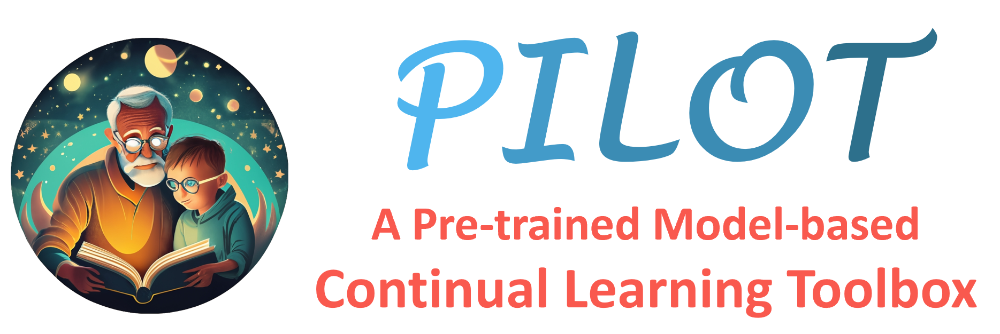
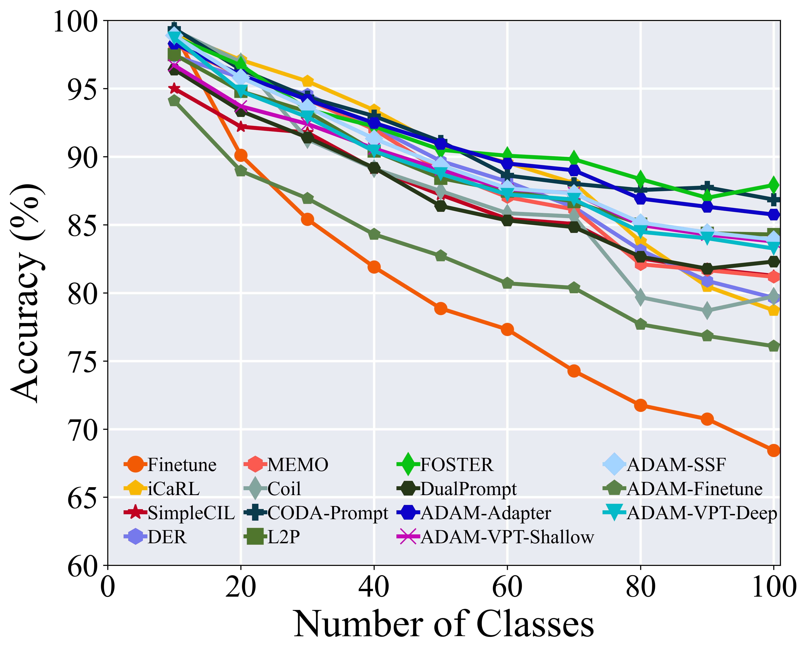
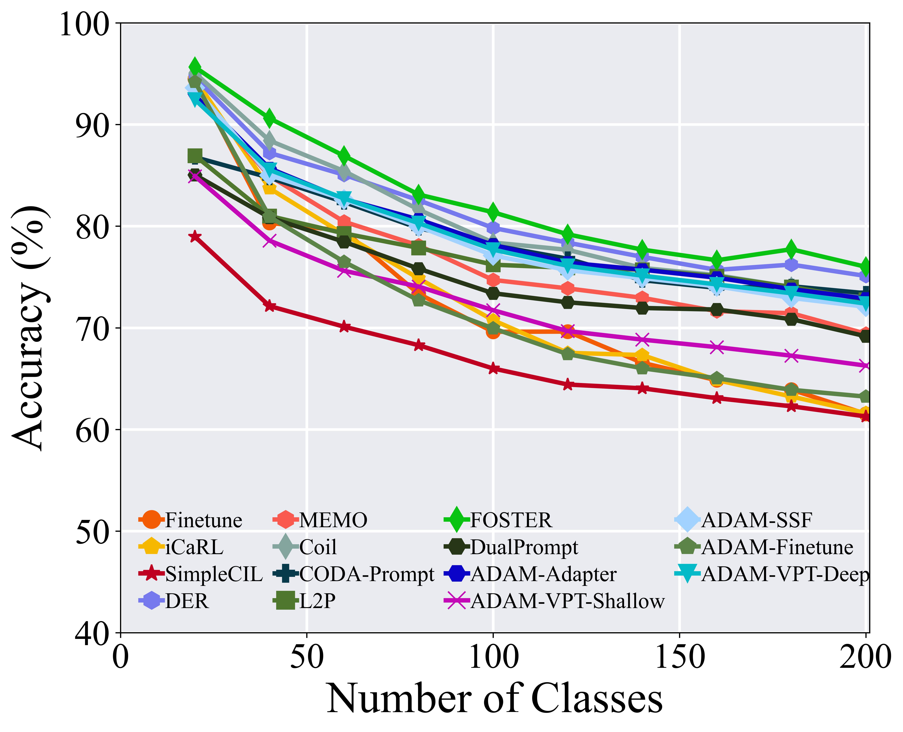

<p align="center">

</p>

<p align="center">
  <a href="#-introduction">🎉Introduction</a> •
  <a href="#-methods-reproduced">🌟Methods Reproduced</a> •
  <a href="#-reproduced-results">📝Reproduced Results</a> <br />
  <a href="#%EF%B8%8F-how-to-use">☄️How to Use</a> •
  <a href="#-acknowledgments">👨‍🏫Acknowledgments</a> •
  <a href="#-contact">🤗Contact</a>
</p>

---

<p align="center">
  <a href=""></a>
  <a href=""></a>
  <a href=""></a>
  <a href=""></a>
  <a href=""></a>
</p>

## 🎉 Introduction

Welcome to PILOT, a pre-trained model-based continual learning toolbox <a href="https://arxiv.org/abs/2309.07117">[Paper]</a>. On the one hand, PILOT implements some state-of-the-art class-incremental learning algorithms based on pre-trained models, such as L2P, DualPrompt, and CODA-Prompt. On the other hand, PILOT also fits typical class-incremental learning algorithms (*e.g.*, FOSTER, and MEMO) within the context of pre-trained models to evaluate their effectiveness.

**If you use any content of this repo for your work, please cite the following bib entry:**

    @article{sun2023pilot,
      title={PILOT: A Pre-Trained Model-Based Continual Learning Toolbox},
      author={Sun, Hai-Long and Zhou, Da-Wei and Ye, Han-Jia and Zhan, De-Chuan},
      journal={arXiv preprint arXiv:2309.07117},
      year={2023}
    }

    @article{zhou2024continual,
      title={Continual Learning with Pre-Trained Models: A Survey},
      author={Zhou, Da-Wei and Sun, Hai-Long and Ning, Jingyi and Ye, Han-Jia and Zhan, De-Chuan},
      journal={arXiv preprint arXiv:2401.16386},
      year={2024}
    }

    @article{zhou2023class,
      author = {Zhou, Da-Wei and Wang, Qi-Wei and Qi, Zhi-Hong and Ye, Han-Jia and Zhan, De-Chuan and Liu, Ziwei},
      title = {Deep Class-Incremental Learning: A Survey},
      journal = {arXiv preprint arXiv:2302.03648},
      year = {2023}
     }

## 📰 What's New

- [2024-04]🌟 Check out our [latest survey](https://arxiv.org/abs/2401.16386) on pre-trained model-based continual learning (**IJCAI 2024**)!
- [2024-03]🌟 Add [EASE](https://arxiv.org/abs/2403.12030). State-of-the-art method of 2024!
- [2024-03]🌟 Check out our [latest work](https://arxiv.org/abs/2403.12030) on pre-trained model-based class-incremental learning (**CVPR 2024**)!
- [2023-12]🌟 Add RanPAC.
- [2023-09]🌟 Initial version of PILOT is released.
- [2023-05]🌟 Check out our recent work about [class-incremental learning with vision-language models](https://arxiv.org/abs/2305.19270)!
- [2023-02]🌟 Check out our [rigorous and unified survey](https://arxiv.org/abs/2302.03648) about class-incremental learning, which introduces some memory-agnostic measures with holistic evaluations from multiple aspects!
- [2023-01]🌟 As team members are committed to other projects and in light of the intense demands of code reviews, **we will prioritize reviewing algorithms that have explicitly cited and implemented methods from our toolbox paper in their publications.** Mentioning this can expedite the review process. We greatly appreciate your patience throughout this period.

## 🌟 Methods Reproduced

- `FineTune`: Baseline method which simply updates parameters on new tasks.
- `iCaRL`: iCaRL: Incremental Classifier and Representation Learning. CVPR 2017 [[paper](https://arxiv.org/abs/1611.07725)]
- `Coil`: Co-Transport for Class-Incremental Learning. ACMMM 2021 [[paper](https://arxiv.org/abs/2107.12654)]
- `DER`: DER: Dynamically Expandable Representation for Class Incremental Learning. CVPR 2021 [[paper](https://arxiv.org/abs/2103.16788)]
- `FOSTER`: Feature Boosting and Compression for Class-incremental Learning. ECCV 2022 [[paper](https://arxiv.org/abs/2204.04662)]
- `MEMO`: A Model or 603 Exemplars: Towards Memory-Efficient Class-Incremental Learning. ICLR 2023 Spotlight [[paper](https://openreview.net/forum?id=S07feAlQHgM)]
- `SimpleCIL`: Revisiting Class-Incremental Learning with Pre-Trained Models: Generalizability and Adaptivity are All You Need. arXiv 2023 [[paper](https://arxiv.org/abs/2303.07338)]
- `L2P`: Learning to Prompt for Continual Learning. CVPR 2022 [[paper](https://arxiv.org/abs/2112.08654)]
- `DualPrompt`: DualPrompt: Complementary Prompting for Rehearsal-free Continual Learning. ECCV 2022 [[paper](https://arxiv.org/abs/2204.04799)]
- `CODA-Prompt`: CODA-Prompt: COntinual Decomposed Attention-based Prompting for Rehearsal-Free Continual Learning. CVPR 2023 [[paper](https://arxiv.org/abs/2211.13218)]
- `ADAM`: Revisiting Class-Incremental Learning with Pre-Trained Models: Generalizability and Adaptivity are All You Need. arXiv 2023 [[paper](https://arxiv.org/abs/2303.07338)]
- `RanPAC`: RanPAC: Random Projections and Pre-trained Models for Continual Learning. NeurIPS 2023 [[paper](https://arxiv.org/abs/2307.02251)]
- `Ease`: Expandable Subspace Ensemble for Pre-Trained Model-Based Class-Incremental Learning. CVPR 2024 [[paper](https://arxiv.org/abs/2403.12030)]

> Intended authors are welcome to contact us to reproduce your methods in our repo. Feel free to merge your algorithm into PILOT if you are using our codebase!

## 📝 Reproduced Results

#### CIFAR-100

<div align="center">

</div>

#### ImageNet-R

<div align="center">

</div>

> For exemplar parameters, Coil, DER, iCaRL, MEMO, and FOSTER set the `fixed_memory` option to false and retain the `memory_size` of 2000 for CIFAR100, while setting `fixed_memory` option to true and retaining the `memory_per_class` of 20 for ImageNet-R. On the contrary, other models are exemplar-free.

## ☄️ how to use

### 🕹️ Clone

Clone this GitHub repository:

```
git clone https://github.com/sun-hailong/LAMDA-PILOT
cd LAMDA-PILOT
```

### 🗂️ Dependencies

1. [torch 2.0.1](https://github.com/pytorch/pytorch)
2. [torchvision 0.15.2](https://github.com/pytorch/vision)
3. [timm 0.6.12](https://github.com/huggingface/pytorch-image-models)
4. [tqdm](https://github.com/tqdm/tqdm)
5. [numpy](https://github.com/numpy/numpy)
6. [scipy](https://github.com/scipy/scipy)

### 🔑 Run experiment

1. Edit the `[MODEL NAME].json` file for global settings and hyperparameters.
2. Run:

    ```bash
    python main.py --config=./exps/[MODEL NAME].json
    ```

3. `hyper-parameters`

    When using PILOT, you can edit the global parameters and algorithm-specific hyper-parameter in the corresponding json file.

    These parameters include:

   - **model_name**: The model's name should be selected from the 11 methods listed above, *i.e.*, `finetune`, `icarl`, `coil`, `der`, `foster`, `memo`, `simplecil`, `l2p`, `dualprompt`, `coda-prompt` and `adam`.
   - **init_cls**: The number of classes in the initial incremental stage. As the configuration of CIL includes different settings with varying class numbers at the outset, our framework accommodates diverse options for defining the initial stage.
   - **increment**: The number of classes in each incremental stage $i$, $i$ > 1. By default, the number of classes is equal across all incremental stages.
   - **backbone_type**: The backbone network of the incremental model. It can be selected from a variety of pre-trained models available in the Timm library, such as **ViT-B/16-IN1K** and **ViT-B/16-IN21K**. Both are pre-trained on ImageNet21K, while the former is additionally fine-tuned on ImageNet1K.
   - **seed**: The random seed is utilized for shuffling the class order. It is set to 1993 by default, following the benchmark setting iCaRL.
   - **fixed_memory**: a Boolean parameter. When set to true, the model will maintain a fixed amount of memory per class. Alternatively, when set to false, the model will preserve dynamic memory allocation per class.
   - **memory_size**: The total number of exemplars in the incremental learning process. If `fixed_memory` is set to false, assuming there are $K$ classes at the current stage, the model will preserve $\left[\frac{{memory-size}}{K}\right]$ exemplars for each class. **L2P, DualPrompt, SimpleCIL, ADAM, and CODA-Prompt do not require exemplars.** Therefore, parameters related to the exemplar are not utilized.
   - **memory_per_class**: If `fixed memory` is set to true, the model will preserve a fixed number of `memory_per_class` exemplars for each class.

### 🔎 Datasets

We have implemented the pre-processing datasets as follows:

- **CIFAR100**: will be automatically downloaded by the code.
- **CUB200**:  Google Drive: [link](https://drive.google.com/file/d/1XbUpnWpJPnItt5zQ6sHJnsjPncnNLvWb/view?usp=sharing) or Onedrive: [link](https://entuedu-my.sharepoint.com/:u:/g/personal/n2207876b_e_ntu_edu_sg/EVV4pT9VJ9pBrVs2x0lcwd0BlVQCtSrdbLVfhuajMry-lA?e=L6Wjsc)
- **ImageNet-R**: Google Drive: [link](https://drive.google.com/file/d/1SG4TbiL8_DooekztyCVK8mPmfhMo8fkR/view?usp=sharing) or Onedrive: [link](https://entuedu-my.sharepoint.com/:u:/g/personal/n2207876b_e_ntu_edu_sg/EU4jyLL29CtBsZkB6y-JSbgBzWF5YHhBAUz1Qw8qM2954A?e=hlWpNW)
- **ImageNet-A**: Google Drive: [link](https://drive.google.com/file/d/19l52ua_vvTtttgVRziCZJjal0TPE9f2p/view?usp=sharing) or Onedrive: [link](https://entuedu-my.sharepoint.com/:u:/g/personal/n2207876b_e_ntu_edu_sg/ERYi36eg9b1KkfEplgFTW3gBg1otwWwkQPSml0igWBC46A?e=NiTUkL)
- **OmniBenchmark**: Google Drive: [link](https://drive.google.com/file/d/1AbCP3zBMtv_TDXJypOCnOgX8hJmvJm3u/view?usp=sharing) or Onedrive: [link](https://entuedu-my.sharepoint.com/:u:/g/personal/n2207876b_e_ntu_edu_sg/EcoUATKl24JFo3jBMnTV2WcBwkuyBH0TmCAy6Lml1gOHJA?e=eCNcoA)
- **VTAB**: Google Drive: [link](https://drive.google.com/file/d/1xUiwlnx4k0oDhYi26KL5KwrCAya-mvJ_/view?usp=sharing) or Onedrive: [link](https://entuedu-my.sharepoint.com/:u:/g/personal/n2207876b_e_ntu_edu_sg/EQyTP1nOIH5PrfhXtpPgKQ8BlEFW2Erda1t7Kdi3Al-ePw?e=Yt4RnV)
- **ObjectNet**: Onedrive: [link](https://entuedu-my.sharepoint.com/:u:/g/personal/n2207876b_e_ntu_edu_sg/EZFv9uaaO1hBj7Y40KoCvYkBnuUZHnHnjMda6obiDpiIWw?e=4n8Kpy) You can also refer to the [filelist](https://drive.google.com/file/d/147Mta-HcENF6IhZ8dvPnZ93Romcie7T6/view?usp=sharing) if the file is too large to download.

> These subsets are sampled from the original datasets. Please note that I do not have the right to distribute these datasets. If the distribution violates the license, I shall provide the filenames instead.

When training **not** on `CIFAR100`, you should specify the folder of your dataset in `utils/data.py`.

```python
    def download_data(self):
        assert 0,"You should specify the folder of your dataset"
        train_dir = '[DATA-PATH]/train/'
        test_dir = '[DATA-PATH]/val/'
```

## 👨‍🏫 Acknowledgments

We thank the following repos providing helpful components/functions in our work.

- [PyCIL](https://github.com/G-U-N/PyCIL)
- [RevisitingCIL](https://github.com/zhoudw-zdw/RevisitingCIL)
- [l2p-pytorch](https://github.com/JH-LEE-KR/l2p-pytorch)
- [CODA-Prompt](https://github.com/GT-RIPL/CODA-Prompt)
- [RanPAC](https://github.com/RanPAC/RanPAC/)

## 🤗 Contact

If there are any questions, please feel free to  propose new features by opening an issue or contact with the author: **Hai-Long Sun**([sunhl@lamda.nju.edu.cn](mailto:sunhl@lamda.nju.edu.cn)) and **Da-Wei Zhou**([zhoudw@lamda.nju.edu.cn](mailto:zhoudw@lamda.nju.edu.cn)). Enjoy the code.

## 🚀 Star History

[](https://star-history.com/#sun-hailong/LAMDA-PILOT&Date)
