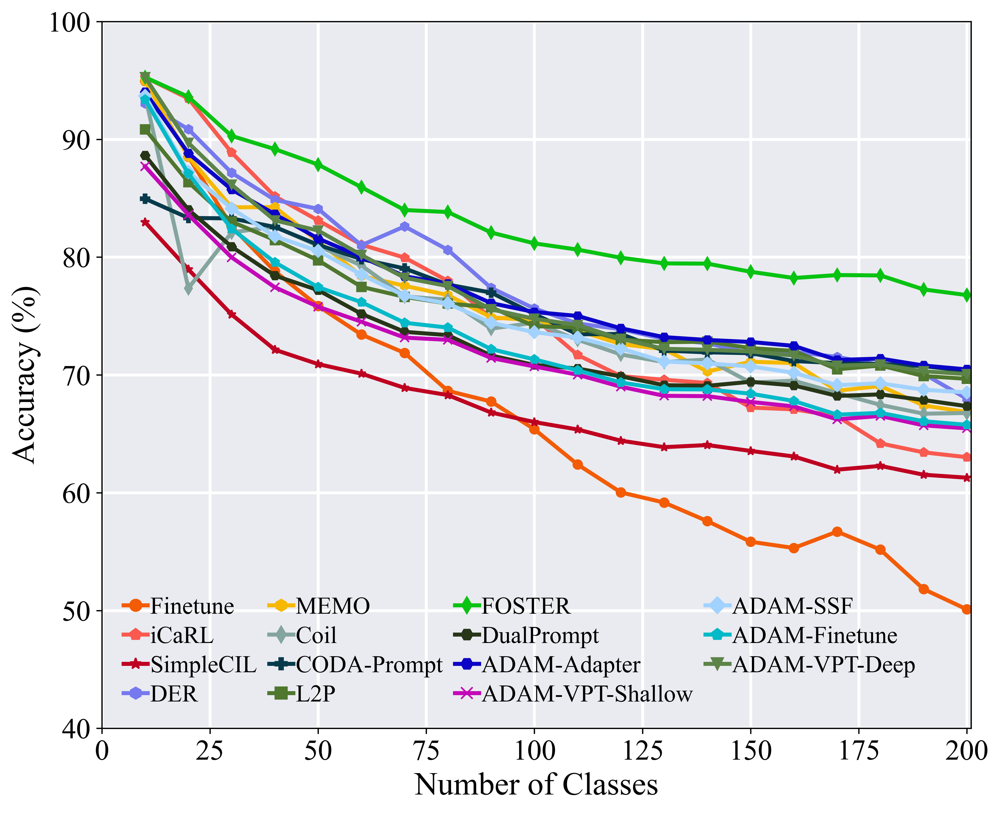

<p align="center">

</p>

<p align="center">
  <a href="#🎉-introduction">🎉Introduction</a> •
  <a href="#🌟-methods-reproduced">🌟Methods Reproduced</a> •
  <a href="#📝-reproduced-results">📝Reproduced Results</a> <br />
  <a href="#☄️-how-to-use">☄️How to Use</a> •
  <a href="#👨‍🏫-acknowledgments">👨‍🏫Acknowledgments</a> •
  <a href="#🤗-contact">🤗Contact</a>
</p>

---

<p align="center">
  <a href=""></a>
  <a href=""></a>
  <a href=""></a>
  <a href=""></a>
  <a href=""></a>
</p>

## 🎉 Introduction

This is a pre-trained class-incremental learning toolbox.

## 🌟 Methods Reproduced

- `FineTune`: Baseline method which simply updates parameters on new tasks.
- `iCaRL`: iCaRL: Incremental Classifier and Representation Learning. CVPR 2017 [[paper](https://arxiv.org/abs/1611.07725)]
- `Coil`: Co-Transport for Class-Incremental Learning. ACMMM 2021 [[paper](https://arxiv.org/abs/2107.12654)]
- `DER`: DER: Dynamically Expandable Representation for Class Incremental Learning. CVPR 2021 [[paper](https://arxiv.org/abs/2103.16788)]
- `FOSTER`: Feature Boosting and Compression for Class-incremental Learning. ECCV 2022 [[paper](https://arxiv.org/abs/2204.04662)]
- `MEMO`: A Model or 603 Exemplars: Towards Memory-Efficient Class-Incremental Learning. ICLR 2023 Spotlight [[paper](https://openreview.net/forum?id=S07feAlQHgM)]
- `SimpleCIL`: Revisiting Class-Incremental Learning with Pre-Trained Models: Generalizability and Adaptivity are All You Need. arXiv 2023 [[paper](https://arxiv.org/abs/2303.07338)]
- `L2P`: Learning to Prompt for Continual Learning. CVPR 2022 [[paper](https://arxiv.org/abs/2112.08654)]
- `DualPrompt`: DualPrompt: Complementary Prompting for Rehearsal-free Continual Learning. ECCV 2022 [[paper](https://arxiv.org/abs/2204.04799)]
- `CODA-Prompt`: CODA-Prompt: COntinual Decomposed Attention-based Prompting for Rehearsal-Free Continual Learning. CVPR 2023 [[paper](https://arxiv.org/abs/2211.13218)]
- `ADAM`: Revisiting Class-Incremental Learning with Pre-Trained Models: Generalizability and Adaptivity are All You Need. arXiv 2023 [[paper](https://arxiv.org/abs/2303.07338)]

> Intended authors are welcome to contact us to reproduce your methods in our repo. Feel free to merge your algorithm into PILT if you are using our codebase!

## 📝 Reproduced-Results

#### CIFAR-100

<div align="center">

</div>

#### ImageNet-R

<div align="center">

</div>

## ☄️ how-to-use

### 🕹️ Clone

Clone this GitHub repository:

```
git clone https://github.com/sun-hailong/LAMDA-PILT
cd LAMDA-PILT
```

### 🗂️ Dependencies

1. [torch 2.0.1](https://github.com/pytorch/pytorch)
2. [torchvision 0.15.2](https://github.com/pytorch/vision)
3. [timm 0.6.12](https://github.com/huggingface/pytorch-image-models)
4. [tqdm](https://github.com/tqdm/tqdm)
5. [numpy](https://github.com/numpy/numpy)
6. [scipy](https://github.com/scipy/scipy)

### 🔑 Run experiment

1. Edit the `[MODEL NAME].json` file for global settings.
2. Edit the `[DATASET NAME]` directory. (e.g. `cifar`)
3. Edit the hyperparameters in the corresponding `[MODEL NAME].py` file (e.g., `models/l2p.py`).
4. Run:

    ```bash
    python main.py --config=./exps/[DATASET NAME]/[MODEL NAME].json
    ```

    where [MODEL NAME] should be chosen from `finetune`, `der`, `coil`, `icarl`, `l2p`,  `dual_prompt`, `coda_prompt`, `simplecil`, `memo`, `foster`, etc.

5. `hyper-parameters`

    When using PILT, you can edit the global parameters and algorithm-specific hyper-parameter in the corresponding json file.

    These parameters include:

    - **memory-size**: The total exemplar number in the incremental learning process. Assuming there are $K$ classes at the current stage, the model will preserve $\left[\frac{memory-size}{K}\right]$ exemplar per class.
    - **init-cls**: The number of classes in the first incremental stage. Since there are different settings in CIL with a different number of classes in the first stage, our framework enables different choices to define the initial stage.
    - **increment**: The number of classes in each incremental stage $i$, $i$ > 1. By default, the number of classes per incremental stage is equivalent per stage.
    - **convnet-type**: The backbone network for the incremental model.
    - **seed**: The random seed adopted for shuffling the class order. According to the benchmark setting, it is set to 1993 by default.

    Other parameters in terms of model optimization, e.g., batch size, optimization epoch, learning rate, learning rate decay, weight decay, milestone, and temperature, can be also modified in the corresponding json file.

### 🔎 Datasets

We have implemented the pre-processing datasets as follows:
- **CIFAR100**: will be automatically downloaded by the code.
  <!-- - **CUB200**:  Google Drive: [link](https://drive.google.com/file/d/1XbUpnWpJPnItt5zQ6sHJnsjPncnNLvWb/view?usp=sharing) or Onedrive: [link](https://entuedu-my.sharepoint.com/:u:/g/personal/n2207876b_e_ntu_edu_sg/EVV4pT9VJ9pBrVs2x0lcwd0BlVQCtSrdbLVfhuajMry-lA?e=L6Wjsc) -->
- **ImageNet-R**: Google Drive: [link](https://drive.google.com/file/d/1SG4TbiL8_DooekztyCVK8mPmfhMo8fkR/view?usp=sharing) or Onedrive: [link](https://entuedu-my.sharepoint.com/:u:/g/personal/n2207876b_e_ntu_edu_sg/EU4jyLL29CtBsZkB6y-JSbgBzWF5YHhBAUz1Qw8qM2954A?e=hlWpNW)
  <!-- - **ImageNet-A**:Google Drive: [link](https://drive.google.com/file/d/19l52ua_vvTtttgVRziCZJjal0TPE9f2p/view?usp=sharing) or Onedrive: [link](https://entuedu-my.sharepoint.com/:u:/g/personal/n2207876b_e_ntu_edu_sg/ERYi36eg9b1KkfEplgFTW3gBg1otwWwkQPSml0igWBC46A?e=NiTUkL) -->
  <!-- - **OmniBenchmark**: Google Drive: [link](https://drive.google.com/file/d/1AbCP3zBMtv_TDXJypOCnOgX8hJmvJm3u/view?usp=sharing) or Onedrive: [link](https://entuedu-my.sharepoint.com/:u:/g/personal/n2207876b_e_ntu_edu_sg/EcoUATKl24JFo3jBMnTV2WcBwkuyBH0TmCAy6Lml1gOHJA?e=eCNcoA) -->
  <!-- - **VTAB**: Google Drive: [link](https://drive.google.com/file/d/1xUiwlnx4k0oDhYi26KL5KwrCAya-mvJ_/view?usp=sharing) or Onedrive: [link](https://entuedu-my.sharepoint.com/:u:/g/personal/n2207876b_e_ntu_edu_sg/EQyTP1nOIH5PrfhXtpPgKQ8BlEFW2Erda1t7Kdi3Al-ePw?e=Yt4RnV) -->
  <!-- - **ObjectNet**: Onedrive: [link](https://entuedu-my.sharepoint.com/:u:/g/personal/n2207876b_e_ntu_edu_sg/EZFv9uaaO1hBj7Y40KoCvYkBnuUZHnHnjMda6obiDpiIWw?e=4n8Kpy) You can also refer to the [filelist](https://drive.google.com/file/d/147Mta-HcENF6IhZ8dvPnZ93Romcie7T6/view?usp=sharing) if the file is too large to download. -->
  

When training on `ImageNet-R`, you should specify the folder of your dataset in `utils/data.py`.

```python
    def download_data(self):
        assert 0,"You should specify the folder of your dataset"
        train_dir = '[DATA-PATH]/train/'
        test_dir = '[DATA-PATH]/val/'
```

## 👨‍🏫 Acknowledgments

We thank the following repos providing helpful components/functions in our work.

- [PyCIL](https://github.com/G-U-N/PyCIL)
- [RevisitingCIL](https://github.com/zhoudw-zdw/RevisitingCIL)
- [l2p-pytorch](https://github.com/JH-LEE-KR/l2p-pytorch)
- [CODA-Prompt](https://github.com/GT-RIPL/CODA-Prompt)

## 🤗 Contact

If there are any questions, please feel free to  propose new features by opening an issue or contact with the author: **Hai-Long Sun**([sunhl@lamda.nju.edu.cn](mailto:sunhl@lamda.nju.edu.cn)) and **Da-Wei Zhou**([zhoudw@lamda.nju.edu.cn](mailto:zhoudw@lamda.nju.edu.cn)). Enjoy the code.

## 🚀 Star History

[](https://star-history.com/#sun-hailong/LAMDA-PILT&Date)
